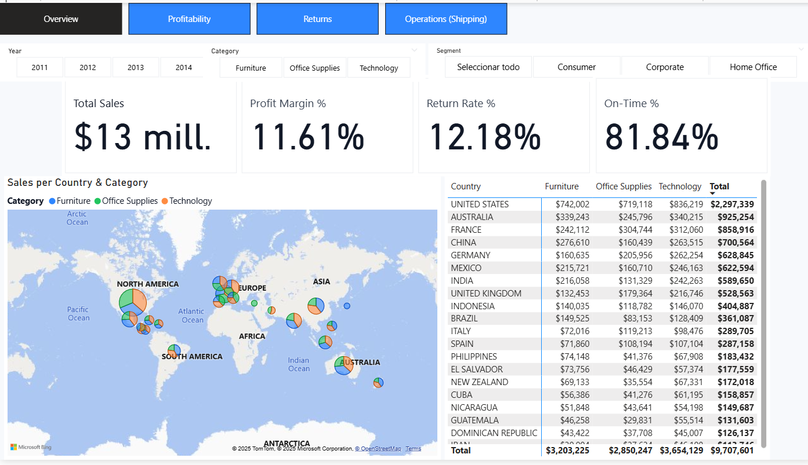
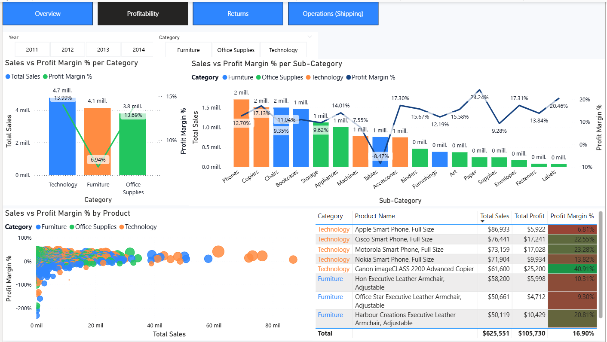
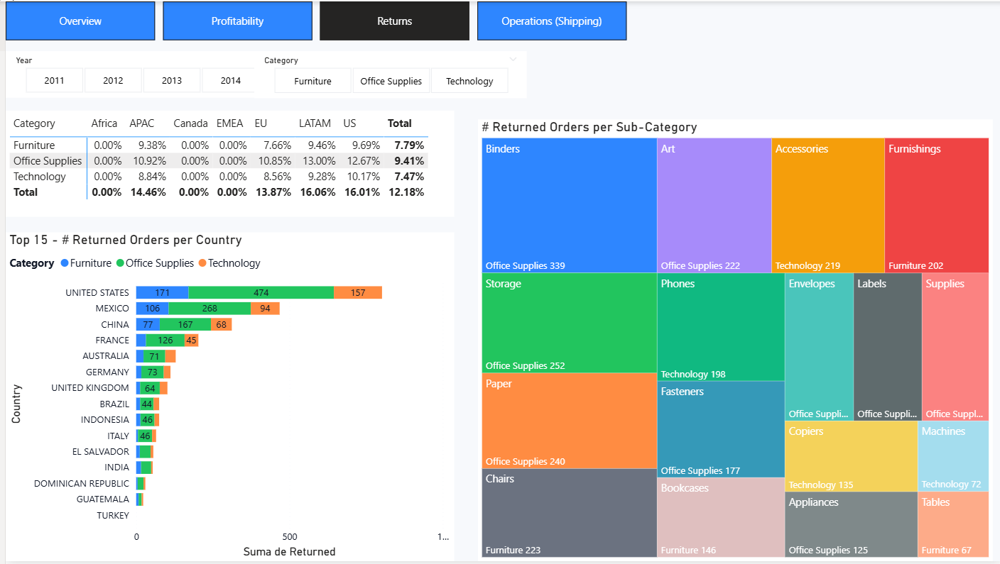
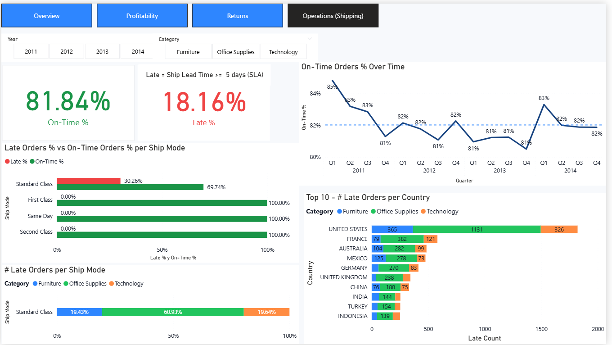

# Global Superstore — Analytics Portfolio

A concise, end-to-end analytics portfolio that pairs **Python** data prep/analysis with a **Power BI** dashboard for business storytelling.

**What reviewers see quickly**
- Clean code and a reproducible pipeline (see `docs/CODE_EXPLAINER.md`)
- A clear BI story for decision makers (see `docs/DASHBOARD_STORY.md`)
- Star-schema exports ready for BI (`data/processed/*.csv`)

---

## 🔎 Quick Preview


---

## 🔧 Quick Start — Python

```bash
# 1) Create a virtual env
python -m venv .venv
# Windows
.venv\Scripts\activate
# macOS/Linux
# source .venv/bin/activate

# 2) Install deps
pip install -r requirements.txt

# 3) Open and run the notebook
jupyter notebook
# Run: Global_Superstore_End_To_End_v9.ipynb  (or use your IDE)
```

> Outputs will be written to `data/processed/` (fact + dimensions). Details in `docs/CODE_EXPLAINER.md`.

### Data
This repo includes the full Kaggle dataset for convenience. If you use the classic Global Superstore workbook, it is stored under `data/raw/GlobalSuperstore.xls` (or `.xlsx`).

## 📚 Data Source
- **Dataset:** [Global Superstore](https://www.kaggle.com/datasets/shekpaul/global-superstore) (public sample retail dataset)
- **Source:** Kaggle — [Global Superstore](https://www.kaggle.com/datasets/shekpaul/global-superstore)
- **Use:** Educational/portfolio purposes only. Please review the dataset’s license/terms on Kaggle before redistribution.
- **Local path:** place the raw workbook at `data/raw/GlobalSuperstore.xls` (or `.xlsx`).

**Note:** This repository includes the full Kaggle dataset for convenience. If you fork it and prefer a lighter repo, move the raw file to `data/raw/` locally and remove it from version control.

---

## 📊 Open the Power BI Dashboard

- File: `reports/powerbi/Global Superstore.pbix`
- Open in Power BI Desktop (or Fabric) -> **Refresh** to load the CSVs in `data/processed/`.
- Read `docs/DASHBOARD_STORY.md` to understand the flow, KPIs, and intended decisions.

> Large files: track `.pbix` (and any `.mp4/.gif`) with Git LFS:
>
> ```bash
> git lfs install
> git lfs track "*.pbix" "*.mp4" "*.gif"
> git add .gitattributes
> ```

---

## 🧱 Repo Layout

```
src/                    # (optional) scripts if you split the notebook
notebooks/              # your .ipynb (e.g., Global_Superstore_End_To_End_v9.ipynb)
data/
  ├─ raw/               # original inputs (excluded from git)
  ├─ sample/            # tiny sample for reproduction
  └─ processed/         # fact + dimensions CSVs for BI
reports/
  └─ powerbi/           # Global Superstore.pbix
docs/
  ├─ CODE_EXPLAINER.md  # how the Python pipeline works
  └─ DASHBOARD_STORY.md # how to read/use the dashboard
requirements.txt
```

---

## ✅ What this project demonstrates

- End-to-end pipeline: **ingest -> clean -> enrich -> analyze -> export**
- Maintainable structure and contracts for **reproducibility**
- BI model alignment (fact/dim), crisp **KPI definitions**, and **storytelling**

---

## 📌 Results (fill with your specifics)

- **OTD%** (On-Time Delivery) improved **X pp** after [action].
- **Late ≥ 5 days** concentrated in **[Top 3 segments/regions]**.
- **Profit margin** sensitivity highest in **[sub-categories]** when **discount > Y%**.

(Replace with your actual outcomes; keep it short.)

---

## 🔗 Helpful docs

- **Code explainer:** `docs/CODE_EXPLAINER.md`
- **Dashboard story & guide:** `docs/DASHBOARD_STORY.md`


## 📸 Screenshots — what to look for

**Overview**

- Check **Profit Margin %** vs **Return Rate %** at a glance.
- Use the **map** to spot large markets with **low margin or high returns**.
- Country table shows **category mix**; look for skew (e.g., Tech-heavy).

**Profitability**

- Category/Sub-Category bars show **margin by mix**; negative bars flag problem areas.
- The **scatter** highlights **high-sales, low-margin** products (fix pricing/discounts).
- Product table surfaces top items with **profit %** for ranking.

**Returns**

- **Return Rate %** by Market × Category shows where policies/suppliers need attention.
- **Top 15 countries** exposes concentration (where to act first).
- Treemap shows **sub-categories** with the most returns (QA/packaging focus).

**Operations (Shipping)**

- **On‑Time %** trend vs reference; watch for quarters below target.
- Ship Mode bars compare **Late % vs On‑Time %**; locate the worst carrier class.
- **Top 10 late countries** guides routing or inventory changes.
